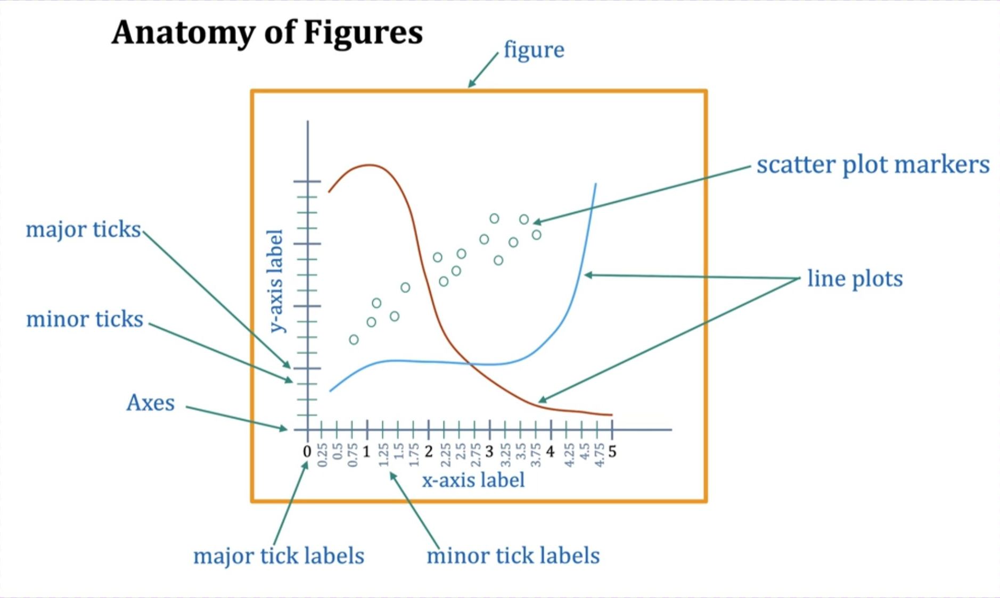

### 核心比喻：画画

- **画板/画框 (Figure)**：这是你用来画画的整个区域，是所有内容的最终载体。你可以有一张大画板，也可以有好几张小画板。在 Matplotlib 中，这个整体就是 `Figure` 对象。
- **画布/绘图区 (Axes)**：这是你在画板上实际作画的那块区域。一块画板上可以只有一个画布（占满整个画板），也可以被分割成好几个独立的画布（比如画四格漫画）。在 Matplotlib 中，这个绘图区就是 `Axes` 对象（注意是 Axes，不是 Axis）。

- **figure (图形/画板)**：整个橙色框框内的所有东西，是最大的容器。
- **Axes (坐标系/画布)**：白色背景的绘图区域，包括了x轴、y轴、数据点、线等。这是我们作画的主要地方。
- **line plots (线图)** 和 **scatter plot markers (散点图标记)**：这些是我们画在 `Axes` 上的具体内容，也就是我们的数据。
- **x-axis label / y-axis label (x/y轴标签)**：用来解释 x 轴和 y 轴分别代表什么。
- **major ticks / minor ticks (主/次刻度线)**：坐标轴上用来标记数值位置的短线。主刻度线通常更长、更粗，并带有标签。
- **major tick labels / minor tick labels (主/次刻度标签)**：坐标轴上刻度线旁边显示的数字。

**最重要的关系**：`Axes` 存在于 `Figure` 之上。我们所有的绘图操作（画线、画点、加标签等）都是在 `Axes`（画布）上进行的，而不是直接在 `Figure`（画板）上。

### Creating a Figure and Axes 

1. **`import matplotlib.pyplot as plt`**
   - 这是使用 Matplotlib 的标准方式。我们导入 `matplotlib.pyplot` 这个模块，并给它起一个简短的别名 `plt`，方便后续调用。
2. **`plt.subplots()`**
   - 这是最核心、最推荐的命令。
   - 它的作用是：**同时创建一个 `Figure` 对象和一个（或多个）`Axes` 对象**。
   - 它返回一个**元组 (tuple)**，里面包含了创建好的 `Figure` 和 `Axes`。
3. **`fig, ax = plt.subplots()`**
   - 这行代码是 Python 中一种叫做“元组解包 (tuple unpacking)”的语法。
   - `plt.subplots()` 返回 `(Figure对象, Axes对象)`。
   - 我们用 `fig, ax = ...` 的形式，把元组里的第一个元素（`Figure` 对象）赋值给变量 `fig`，第二个元素（`Axes` 对象）赋值给变量 `ax`。
   - 现在：
     - `fig` 就代表我们的**画板**。
     - `ax` 就代表我们的**画布**。
   - 执行完这行代码后，你就拥有了一张空白的图表，就像准备好了一张白纸和画框，随时可以开始画画。

**小结**：`fig, ax = plt.subplots()` 是开启 Matplotlib 绘图的标准“咒语”。它为你准备好了所有绘图需要的基础设施。

### Plotting Data (绘制数据)

有了空白的画布 (`ax`)，现在我们要在上面画东西了。

1. **`ax.plot(x_coords, y_coords, label='...')`**
   - 注意看这个命令的开头是 `ax.`，这表示我们是在 `ax` 这个**画布对象**上进行操作。
   - `.plot()` 是一个方法（函数），用来画线图。
   - `x_coords`, `y_coords`：分别是 x 坐标和 y 坐标的数据，可以是列表、NumPy 数组等。
   - `label='...'`：给这条线起个名字，这个名字会在图例（legend）中显示。
   - 你可以多次调用 `ax.plot()` 在同一个画布上画多条线。
2. **显示图形**
   - 在 Jupyter Notebook 或类似的环境中，单元格执行完毕后，图形会自动显示出来。
   - 如果在普通的 Python 脚本（`.py` 文件）中运行，你需要最后加上 `plt.show()` 才能把图形弹窗显示出来。

### Additional Axes Settings (额外的 Axes 设置)

画完数据后，我们需要对图表进行美化和说明，让别人能看懂。

1. **`ax.set_xlabel('...')`**, **`ax.set_ylabel('...')`**, **`ax.set_title('...')`**
   - 这些命令同样是以 `ax.` 开头，表示我们是在**修饰 `ax` 这个画布**。
   - 它们分别用来设置 x 轴的标签、y 轴的标签和整个画布的标题。
2. **`ax.legend()`**
   - 这个命令会创建一个图例。图例会查找你在 `ax.plot()` 中设置的所有 `label`，然后把它们和一个小小的线段样本一起显示出来，告诉读者哪条线代表什么。

**小结**：所有对图表细节的调整（标题、标签、图例等），都是通过调用 `ax` 对象的 `set_...` 系列方法和其它方法（如 `.legend()`）来完成的。