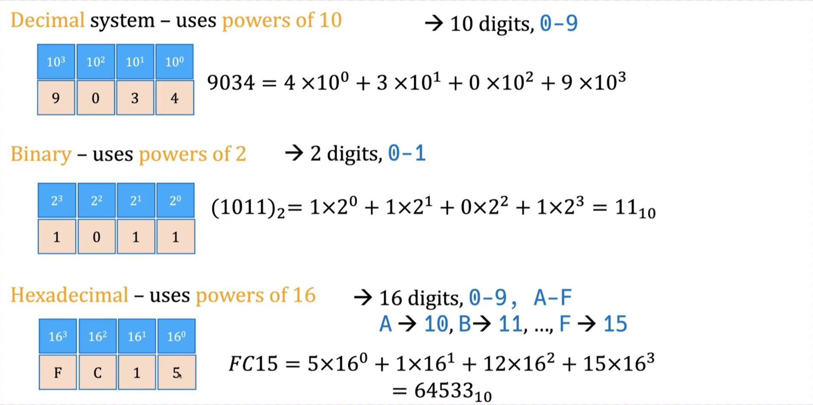

## ASCII 

ASCII 通过 **数值编码** 映射到 **字符**，包括可打印和不可打印的字符。

ASCII 编码使用 **7 个二进制位（bits）** 来表示一个字符的数值。也就是说，ASCII 编码可以表示 **0 到 127** 之间的 128 个字符。

95个可打印的字符，33个不可打印的字符

**ASCII**（只支持 128 个字符），但是它太有限，无法满足世界上不同语言的需求。于是人们尝试扩展 ASCII，但这些扩展标准不统一，导致混乱。

nicode 主要解决字符编码混乱的问题，它的 核心目标是：

+ 为每个字符分配一个唯一的编号（称为 **code point**，即 "代码点"）。

+ 不规定代码点如何存储到计算机的二进制格式中，而是交由编码方式（如 UTF-8、UTF-16）去决定。

**Python 默认使用 UTF-8**

- **UTF-8** 是 Unicode 的一种编码方式，它是 **Python 默认使用的编码**。
- 其他编码方式还包括 UTF-16、UTF-32，但它们不如 UTF-8 常见。

## 进制的转换

